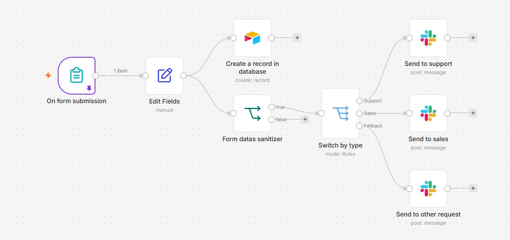
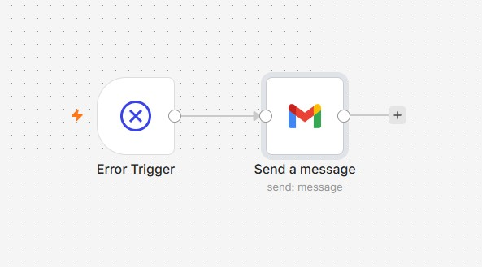

# 📋 Workflow de gestion de formulaire de contact — n8n + Airtable + Slack

Workflow n8n automatisant le traitement d'un formulaire de contact. Chaque soumission est nettoyée, enregistrée dans une base Airtable, puis routée automatiquement vers le bon canal Slack (Support, Sales ou Autre) selon le type de demande. Un second workflow surveille les erreurs d'exécution et envoie une alerte par email en cas d'incident.

Ce projet a été réalisé dans le cadre du cours [Prenez en main n8n](https://openclassrooms.com) sur OpenClassrooms.

[](./support-workflow.jpg)

---

## ⚙️ Fonctionnement

```
Formulaire → Edit Fields (nettoyage) → Création enregistrement Airtable
                                      → Switch by type → Support  → Slack #support
                                                        → Sales    → Slack #sales
                                                        → Fallback → Slack #autre
```

### Étapes détaillées

| # | Nœud | Description |
|---|------|-------------|
| 1 | **On form submission** | Déclenchement à la soumission du formulaire (Prénom, Nom, Email, Type, Urgence, Description) |
| 2 | **Edit Fields** | Nettoyage et formatage des champs (mise en majuscule du nom, conversion de la date, etc.) |
| 3 | **Create a record in database** | Enregistrement de la demande dans une base Airtable |
| 4 | **Form datas sanitizer** | Vérification que les données obligatoires sont présentes |
| 5 | **Switch by type** | Routage selon le type de demande : Support / Sales / Fallback |
| 6 | **Send to support** | Notification Slack au canal Support |
| 7 | **Send to sales** | Notification Slack au canal Sales |
| 8 | **Send to other request** | Notification Slack pour les autres demandes |

---

## 🚨 Gestion des erreurs

Un workflow dédié (`error-workflow.jpg`) est attaché en tant qu'*Error Workflow* du workflow principal. En cas d'échec d'exécution, il se déclenche automatiquement via un nœud **Error Trigger** et envoie un email d'alerte via Gmail, permettant une réaction rapide en cas de panne.

[](./error-workflow.jpg)

---

## 🛠️ Stack technique

| Outil | Rôle |
|-------|------|
| [n8n](https://n8n.io) | Orchestration du workflow |
| n8n Form Trigger | Réception des soumissions de formulaire |
| [Airtable](https://airtable.com) | Stockage des demandes |
| [Slack](https://slack.com) | Notification des équipes par type de demande |
| Gmail | Alerte par email en cas d'erreur d'exécution |

---

## 🚀 Installation

### Prérequis

- Instance n8n (self-hosted ou cloud)
- Compte Airtable avec une base configurée et une clé API / token
- Workspace Slack avec les canaux Support, Sales et Autre, et une app/bot connecté
- Compte Gmail avec OAuth2 configuré dans n8n (pour le workflow d'erreur)

### Import du workflow

1. Télécharger le fichier `support-workflow.json`
2. Dans n8n : **Workflows** → **Import from file**
3. Configurer les credentials :
   - `Airtable account` → ajouter votre token API Airtable et sélectionner la base/table cible
   - `Slack account` → connecter via OAuth2 et adapter les canaux dans les nœuds Slack
4. (Optionnel) Créer le workflow de gestion d'erreurs et le rattacher comme *Error Workflow* dans les paramètres du workflow principal
5. Activer le workflow (toggle en haut à droite)

---

## 📁 Structure du repo

```
.
├── README.md
├── support-workflow.json     # Workflow n8n exporté (formulaire → Airtable → Slack)
├── support-workflow.jpg      # Capture du workflow principal
└── error-workflow.jpg        # Capture du workflow de gestion d'erreurs
```
